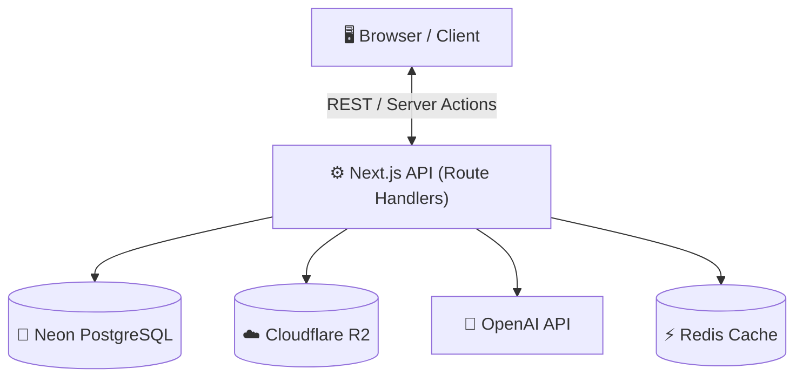
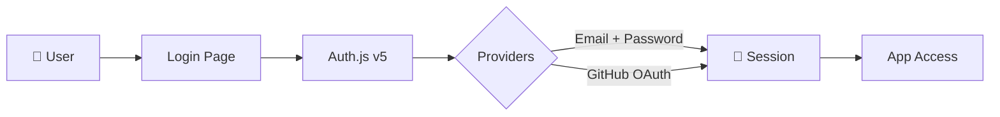
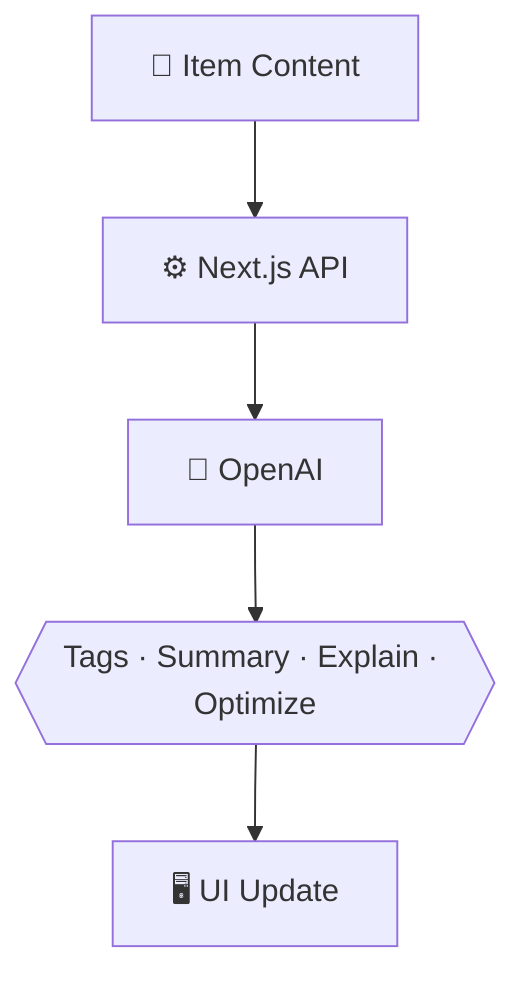

# DevStash — Project Overview

> **Store Smarter. Build Faster.**
> A centralized, AI-enhanced knowledge hub for developers.

---

## Table of Contents

1. [Problem](#problem)
2. [Users](#users)
3. [Core Features](#core-features)
4. [Data Model](#data-model)
5. [Tech Stack](#tech-stack)
6. [Monetization](#monetization)
7. [UI / UX](#ui--ux)
8. [Architecture](#architecture)
9. [Auth Flow](#auth-flow)
10. [AI Features](#ai-features)
11. [Project Structure](#project-structure)
12. [Roadmap](#roadmap)
13. [Next Steps](#next-steps)
14. [Development Workflow](#development-workflow)

---

## Problem

Developers keep their essentials scattered across too many places:

| Location | What lives there |
|---|---|
| VS Code / Notion | Code snippets |
| Chat history | AI prompts |
| Buried project folders | Context files |
| Browser bookmarks | Useful links |
| Random folders | Docs |
| `.txt` files | Commands |
| GitHub Gists | Project templates |
| Bash history | Terminal commands |

This creates **context switching, lost knowledge, and inconsistent workflows**.

**DevStash** provides one searchable, AI-enhanced hub for all dev knowledge and resources.

---

## Users

| Persona | Needs |
|---|---|
| 🧑‍💻 Everyday Developer | Quick access to snippets, commands, links |
| 🤖 AI-First Developer | Store prompts, workflows, context files |
| 🎓 Content Creator / Educator | Course notes, reusable code examples |
| 🏗️ Full-Stack Builder | Patterns, boilerplates, API references |

---

## Core Features

### A) Items & Item Types

Every saved resource is an **Item** with a built-in type:

| Icon | Type | Description |
|------|------|-------------|
| `</>` | **Snippet** | Code in any language, with syntax highlighting |
| `✨` | **Prompt** | AI prompts and system messages |
| `📝` | **Note** | Markdown notes and docs |
| `$_` | **Command** | Terminal / shell commands |
| `📄` | **File** | Uploaded files (PDFs, templates, etc.) |
| `🖼️` | **Image** | Screenshots, diagrams, references |
| `🔗` | **URL** | Bookmarked links with previews |

> Pro users can define **custom item types** with a custom name, icon, and color.

### B) Collections

Group items of any type into named collections:

- `React Patterns`
- `Context Files`
- `Python Snippets`
- `Interview Prep`

### C) Search

Full-text search across: content · tags · titles · item types

### D) Authentication

- Email + Password
- GitHub OAuth

### E) Additional Features

- ⭐ Favorites & 📌 pinned items
- 🕐 Recently used tracking
- 📥 Import from files
- ✏️ Markdown editor for text items
- ☁️ File uploads (images, docs, templates)
- 📤 Export (JSON / ZIP)
- 🌙 Dark mode (default)

### F) AI Features _(Pro)_

| Feature | Description |
|---|---|
| 🏷️ Auto-tagging | Suggests tags based on content |
| 📋 AI Summary | One-line summary of any item |
| 💡 Explain Code | Plain-English code explanation |
| ✨ Prompt Optimizer | Rewrites prompts for better results |

> Powered by **OpenAI** — [`gpt-4o-mini`](https://platform.openai.com/docs/models) recommended for cost-effective AI features.

---

## Data Model

> This schema is a starting point and will evolve.

```prisma
// schema.prisma

enum ContentType {
  TEXT
  FILE
}

model User {
  id                   String       @id @default(cuid())
  email                String       @unique
  password             String?
  name                 String?
  image                String?
  isPro                Boolean      @default(false)
  stripeCustomerId     String?      @unique
  stripeSubscriptionId String?      @unique
  items                Item[]
  itemTypes            ItemType[]
  collections          Collection[]
  tags                 Tag[]
  createdAt            DateTime     @default(now())
  updatedAt            DateTime     @updatedAt
}

model Item {
  id          String      @id @default(cuid())
  title       String
  contentType ContentType @default(TEXT)
  content     String?     // populated for TEXT items
  fileUrl     String?     // populated for FILE items
  fileName    String?
  fileSize    Int?
  url         String?     // for URL type items
  description String?
  language    String?     // e.g. "typescript", "python"
  isFavorite  Boolean     @default(false)
  isPinned    Boolean     @default(false)
  lastUsedAt  DateTime?   // tracked for "Recently Used"

  userId       String
  user         User        @relation(fields: [userId], references: [id], onDelete: Cascade)

  typeId       String
  type         ItemType    @relation(fields: [typeId], references: [id])

  collectionId String?
  collection   Collection? @relation(fields: [collectionId], references: [id])

  tags         ItemTag[]

  createdAt    DateTime    @default(now())
  updatedAt    DateTime    @updatedAt
}

model ItemType {
  id       String  @id @default(cuid())
  name     String
  icon     String?
  color    String?
  isSystem Boolean @default(false) // true = built-in, false = user-created

  userId   String?
  user     User?   @relation(fields: [userId], references: [id], onDelete: Cascade)

  items    Item[]

  @@unique([name, userId]) // prevent duplicate custom types per user
}

model Collection {
  id          String   @id @default(cuid())
  name        String
  description String?
  isFavorite  Boolean  @default(false)

  userId      String
  user        User     @relation(fields: [userId], references: [id], onDelete: Cascade)

  items       Item[]

  createdAt   DateTime @default(now())
  updatedAt   DateTime @updatedAt
}

model Tag {
  id     String    @id @default(cuid())
  name   String
  userId String
  user   User      @relation(fields: [userId], references: [id], onDelete: Cascade)
  items  ItemTag[]

  @@unique([name, userId]) // tags are unique per user
}

model ItemTag {
  itemId String
  tagId  String
  item   Item   @relation(fields: [itemId], references: [id], onDelete: Cascade)
  tag    Tag    @relation(fields: [tagId], references: [id], onDelete: Cascade)

  @@id([itemId, tagId])
}
```

> **Schema notes:**
> - `onDelete: Cascade` ensures orphaned records are cleaned up automatically.
> - `lastUsedAt` on `Item` enables the "Recently Used" view without a separate table.
> - `@@unique([name, userId])` on `Tag` and `ItemType` prevents duplicates scoped per user.
> - An item currently belongs to one collection. If multi-collection support is needed later, replace `collectionId` on `Item` with a `CollectionItem` join table.

---

## Tech Stack

| Category | Choice | Docs |
|---|---|---|
| Framework | Next.js 15 (App Router, React 19) | [nextjs.org](https://nextjs.org/docs) |
| Language | TypeScript | [typescriptlang.org](https://www.typescriptlang.org/docs/) |
| Database | Neon PostgreSQL | [neon.tech](https://neon.tech/docs) |
| ORM | Prisma | [prisma.io/docs](https://www.prisma.io/docs) |
| Caching | Upstash Redis _(optional)_ | [upstash.com](https://upstash.com/docs/redis/overall/getstarted) |
| File Storage | Cloudflare R2 | [developers.cloudflare.com/r2](https://developers.cloudflare.com/r2/) |
| CSS | Tailwind CSS v4 | [tailwindcss.com](https://tailwindcss.com/docs) |
| Components | shadcn/ui | [ui.shadcn.com](https://ui.shadcn.com) |
| Auth | Auth.js v5 (NextAuth) | [authjs.dev](https://authjs.dev) |
| AI | OpenAI API | [platform.openai.com/docs](https://platform.openai.com/docs) |
| Payments | Stripe | [stripe.com/docs](https://stripe.com/docs) |
| Deployment | Vercel | [vercel.com/docs](https://vercel.com/docs) |
| Monitoring | Sentry | [docs.sentry.io](https://docs.sentry.io) |

---

## Monetization

| Plan | Price | Item Limit | Collections | AI | File Uploads | Custom Types | Export |
|---|---|---|---|---|---|---|---|
| **Free** | $0 | 50 | 3 | ❌ | Images only | ❌ | ❌ |
| **Pro** | $8/mo or $72/yr | Unlimited | Unlimited | ✅ | All types | ✅ | ✅ JSON/ZIP |

> Billing via **[Stripe](https://stripe.com/docs/billing)** — subscriptions + webhooks to sync `isPro` and `stripeSubscriptionId` on the `User` model.

---

## UI / UX

### Design Principles

- 🌙 **Dark mode first** — developer-native aesthetic
- ⚡ **Minimal and fast** — low friction, keyboard-friendly
- `</>` **Syntax highlighting** — via [Shiki](https://shiki.style) or [highlight.js](https://highlightjs.org)
- Inspired by **Notion**, **Linear**, and **Raycast**

### Screenshots

Refer to the screenshots below as a base for the dashboard ui. It does not have to be exact. Use it as a reference:
@context/screenshots/dashboard-ui-drawer.png
@context/screenshots/dashboard-ui-main.png

### Layout

```
┌─────────────────────────────────────────────────────┐
│  Sidebar (collapsible)  │  Main Workspace            │
│                         │                            │
│  🔍 Search              │  ┌──────┐ ┌──────┐        │
│  ─────────              │  │ Item │ │ Item │  ...   │
│  📌 Pinned              │  └──────┘ └──────┘        │
│  ⭐ Favorites           │                            │
│  🕐 Recent              │  [ Grid / List toggle ]    │
│  ─────────              │                            │
│  Collections            │                            │
│   └ React Patterns      │  ┌──────────────────────┐ │
│   └ Python Snippets     │  │  Full-screen editor  │ │
│   └ + New               │  └──────────────────────┘ │
│  ─────────              │                            │
│  Item Types             │                            │
│  Tags                   │                            │
│  ─────────              │                            │
│  ⚙️ Settings            │                            │
│  💳 Upgrade to Pro      │                            │
└─────────────────────────────────────────────────────┘
```

### Responsive

- Mobile: sidebar becomes a drawer
- Touch-optimized icons and buttons

---

## Architecture



---

## Auth Flow



---

## AI Features



---

## Project Structure

```
devstash/
├── app/
│   ├── (auth)/                        # Unauthenticated routes
│   │   ├── login/
│   │   │   └── page.tsx
│   │   └── register/
│   │       └── page.tsx
│   │
│   ├── (dashboard)/                   # Authenticated app shell
│   │   ├── layout.tsx                 # Sidebar + header wrapper
│   │   ├── page.tsx                   # Redirects to /items
│   │   ├── items/
│   │   │   ├── page.tsx               # Main item grid/list
│   │   │   └── [id]/
│   │   │       └── page.tsx           # Item detail / editor
│   │   ├── collections/
│   │   │   ├── page.tsx
│   │   │   └── [id]/
│   │   │       └── page.tsx
│   │   └── settings/
│   │       └── page.tsx
│   │
│   ├── api/
│   │   ├── auth/
│   │   │   └── [...nextauth]/
│   │   │       └── route.ts           # Auth.js handler
│   │   ├── items/
│   │   │   ├── route.ts               # GET (list), POST (create)
│   │   │   └── [id]/
│   │   │       └── route.ts           # GET, PATCH, DELETE
│   │   ├── collections/
│   │   │   ├── route.ts
│   │   │   └── [id]/
│   │   │       └── route.ts
│   │   ├── tags/
│   │   │   └── route.ts
│   │   ├── upload/
│   │   │   └── route.ts               # Signed URL generation for R2
│   │   ├── ai/
│   │   │   ├── tag/route.ts
│   │   │   ├── summarize/route.ts
│   │   │   ├── explain/route.ts
│   │   │   └── optimize/route.ts
│   │   └── webhooks/
│   │       └── stripe/
│   │           └── route.ts           # Stripe subscription events
│   │
│   ├── layout.tsx                     # Root layout (fonts, providers)
│   └── globals.css
│
├── components/
│   ├── ui/                            # shadcn/ui generated components
│   ├── items/
│   │   ├── item-card.tsx
│   │   ├── item-grid.tsx
│   │   ├── item-editor.tsx            # Full-screen create/edit form
│   │   ├── item-type-badge.tsx
│   │   └── item-actions.tsx           # Favorite, pin, delete menu
│   ├── collections/
│   │   ├── collection-card.tsx
│   │   └── collection-picker.tsx
│   ├── layout/
│   │   ├── sidebar.tsx
│   │   ├── sidebar-nav.tsx
│   │   └── top-bar.tsx
│   └── shared/
│       ├── search-bar.tsx
│       ├── tag-input.tsx
│       ├── markdown-editor.tsx
│       ├── code-block.tsx             # Syntax-highlighted display
│       └── empty-state.tsx
│
├── lib/
│   ├── prisma.ts                      # Prisma client singleton
│   ├── auth.ts                        # Auth.js config + providers
│   ├── openai.ts                      # OpenAI client
│   ├── r2.ts                          # Cloudflare R2 client + helpers
│   ├── stripe.ts                      # Stripe client + plan helpers
│   └── utils.ts                       # cn(), formatters, etc.
│
├── hooks/
│   ├── use-items.ts
│   ├── use-collections.ts
│   └── use-search.ts
│
├── types/
│   └── index.ts                       # Shared TypeScript types / Prisma extensions
│
├── prisma/
│   ├── schema.prisma
│   └── seed.ts                        # Seeds system ItemTypes
│
├── public/
├── .env.local
├── next.config.ts
├── tailwind.config.ts
└── package.json
```

### Key conventions

- **Route groups** — `(auth)` and `(dashboard)` share layouts without affecting the URL.
- **API routes vs Server Actions** — use Route Handlers for webhooks and file uploads; use Server Actions for simple form mutations (create item, toggle favorite).
- **`lib/` singletons** — instantiate each external client once and import from `lib/`, never inline.
- **`prisma/seed.ts`** — seeds the 7 system `ItemType` rows on first deploy so they are always present without manual SQL.

---

## Roadmap

### MVP
- [ ] Auth (email + GitHub)
- [ ] Items CRUD (all 7 built-in types)
- [ ] Collections
- [ ] Full-text search
- [ ] Tags
- [ ] Favorites & pinned
- [ ] Recently used
- [ ] Free tier limits enforced

### Pro Phase
- [ ] Stripe billing + upgrade flow
- [ ] AI features (auto-tag, summary, explain, optimize)
- [ ] Custom item types
- [ ] File uploads (Cloudflare R2)
- [ ] Export (JSON / ZIP)
- [ ] Markdown editor

### Future
- [ ] Shared / public collections
- [ ] Team & Org plans
- [ ] VS Code extension
- [ ] Browser extension (save page → DevStash)
- [ ] Public API + CLI tool
- [ ] Import from Notion, GitHub Gists

---

## Next Steps

Ordered by dependency — each step unblocks the next.

### 1. Project Bootstrap
- [ ] `npx create-next-app@latest devstash --typescript --tailwind --app`
- [ ] Install and init shadcn/ui: `npx shadcn@latest init`
- [ ] Install core deps: `prisma`, `@prisma/client`, `next-auth@beta`, `stripe`, `openai`, `@aws-sdk/client-s3`
- [ ] Set up `.env.local` with placeholder keys for all services

### 2. Database
- [ ] Create [Neon](https://neon.tech) project, copy `DATABASE_URL`
- [ ] Write `prisma/schema.prisma` (use schema above as starting point)
- [ ] Run `npx prisma migrate dev --name init`
- [ ] Write and run `prisma/seed.ts` to insert the 7 system item types

### 3. Auth
- [ ] Configure Auth.js v5 in `lib/auth.ts` — Email + GitHub providers
- [ ] Add `app/api/auth/[...nextauth]/route.ts`
- [ ] Build login and register pages under `app/(auth)/`
- [ ] Protect the `(dashboard)` layout with a session check / middleware

### 4. Core Layout
- [ ] Build `components/layout/sidebar.tsx` — collapsible, with nav sections
- [ ] Wire up `app/(dashboard)/layout.tsx` with the sidebar
- [ ] Add a top bar with search input and user avatar/menu
- [ ] Add mobile drawer variant of the sidebar

### 5. Items — CRUD
- [ ] `GET /api/items` — list with filters (type, collection, tag, favorites, pinned, recent)
- [ ] `POST /api/items` — create
- [ ] `PATCH /api/items/[id]` — update
- [ ] `DELETE /api/items/[id]` — delete
- [ ] Build item card, grid, and full-screen editor components
- [ ] Add syntax highlighting via [Shiki](https://shiki.style) for Snippet and Command types

### 6. Collections & Tags
- [ ] Collections CRUD (`/api/collections`)
- [ ] Tag management (`/api/tags`) — auto-create on item save
- [ ] Filter sidebar by collection / tag

### 7. Search
- [ ] Full-text search endpoint — use [Postgres `to_tsvector`](https://www.postgresql.org/docs/current/textsearch-intro.html) or a simple `ILIKE` query for MVP
- [ ] Wire up the search bar with debounced requests

### 8. Free Tier Limits
- [ ] Middleware or service helper: check item count (≤ 50) and collection count (≤ 3) before creating
- [ ] Show upgrade prompt when limits are hit

### 9. File Uploads _(Pro)_
- [ ] Set up Cloudflare R2 bucket + CORS policy
- [ ] `POST /api/upload` — generate a presigned URL; client uploads directly to R2
- [ ] Store `fileUrl`, `fileName`, `fileSize` on the `Item`

### 10. Stripe Billing _(Pro)_
- [ ] Create products + prices in Stripe dashboard
- [ ] Checkout session endpoint
- [ ] `POST /api/webhooks/stripe` — handle `customer.subscription.updated` / `deleted` → flip `isPro`
- [ ] Settings page with current plan, upgrade button, and portal link

### 11. AI Features _(Pro)_
- [ ] `/api/ai/tag` — suggest tags from item content
- [ ] `/api/ai/summarize` — one-sentence summary
- [ ] `/api/ai/explain` — plain-English code explanation
- [ ] `/api/ai/optimize` — rewrite prompt for clarity
- [ ] Gate all AI endpoints behind `isPro` check

### 12. Polish & Launch
- [ ] Export endpoint — serialize items to JSON or ZIP
- [ ] Markdown editor for Note items ([`@uiw/react-md-editor`](https://uiwjs.github.io/react-md-editor/) or [Tiptap](https://tiptap.dev))
- [ ] Add Sentry for error monitoring
- [ ] `robots.txt`, `og:image`, favicon
- [ ] Deploy to Vercel, point custom domain

---

## Development Workflow

- **One branch per lesson** — students can follow along and compare diffs
- AI-assisted development with **Cursor**, **Claude Code**, or **ChatGPT**
- **Sentry** for runtime error tracking
- **GitHub Actions** for CI (lint + type-check on PRs)

```bash
# Branch naming convention
git switch -c lesson-01-setup
git switch -c lesson-02-auth
git switch -c lesson-03-items-crud
# etc.
```

---

## Status

> 🟡 **In Planning** — environment setup and UI scaffolding next.
